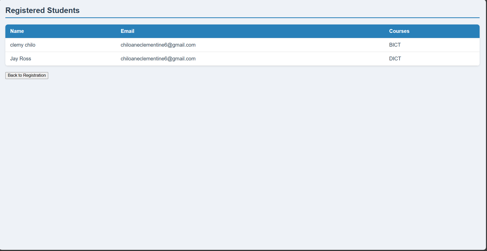

# 📚 JSF Student Registration System

A **Jakarta EE** web application built with **JavaServer Faces (JSF)** to manage student registrations. This practical lab, developed as part of my studies, demonstrates form handling, server-side validation, and an MVC architecture using Managed Beans and custom converters, serving as a hands-on learning exercise.


## 🌟 Features
- **Student Registration**: Add students via a form capturing details (e.g., name, course).
- **Server-Side Validation**: Validates inputs using JSF.
- **Managed Beans**: Handles form data and logic.
- **Custom Converters**: Processes course data.
- **Responsive UI**: Clean design adaptable to different devices.


## 🛠 Technologies Used
- **Java**: JDK 8+
- **Jakarta EE**: JSF 2.3
- **HTML/XHTML & CSS**: Structured and styled pages
- **Servlets**: Backend request handling
- **GlassFish Server**: v5.1+ (required for deployment)
- **NetBeans IDE**: Development environment
- **Maven**: Build and dependency management


## 📂 Project Structure

jsf-course-example/
├── src/                # Source files
├── target/             # Compiled output and build artifacts
├── nb-configuration    # NetBeans configuration
├── pom                 # Maven build file
└── README.md           # Project documentation


## ⚙️ How to Run Locally

### Prerequisites
- **Java**: JDK 8+ installed
- **NetBeans IDE**: Version 12+ with GlassFish support
- **GlassFish Server**: v5.1+ configured
- **Maven**: For building the project

### Steps
1. **Clone the Repository**  
   ```bash
   git clone https://github.com/Mkhenso-jay/StudentRegistrationLab.git
   
2.Open in NetBeans

Launch NetBeans.
Go to File → Open Project and select the jsf-course-example folder.

3.Configure GlassFish Server

In NetBeans, go to Tools → Servers and ensure GlassFish is added.
In Project Properties → Run, set GlassFish as the server.

4. Run the Project

Right-click the project and select Run.
Open a browser and visit: http://localhost:8080/jsf-course-example

(Note: The context path is jsf-course-example due to project configuration, despite the folder name being StudentRegistrationLab. To change this to StudentRegistrationLab, edit the pom.xml or glassfish-web.xml file.)


Troubleshooting

Ensure GlassFish is running (check Services tab).
Verify pom dependencies match your environment.

## 📸 Screenshots

### 1. Registration Form Page


*This screenshot shows the `index.xhtml` page of the JSF Student Registration System at `http://localhost:8080/StudentRegistrationSystem/index.xhtml`. It displays the student registration form with input fields for name, course, and other details, along with server-side validation messages, illustrating the primary interface for adding new students.*

### 2. Student List Page


*This screenshot captures the `studentList.xhtml` page at `http://localhost:8080/StudentRegistrationSystem/studentList.xhtml`. It presents a table or list of registered students, showcasing the data management feature of the application after successful registrations.*
